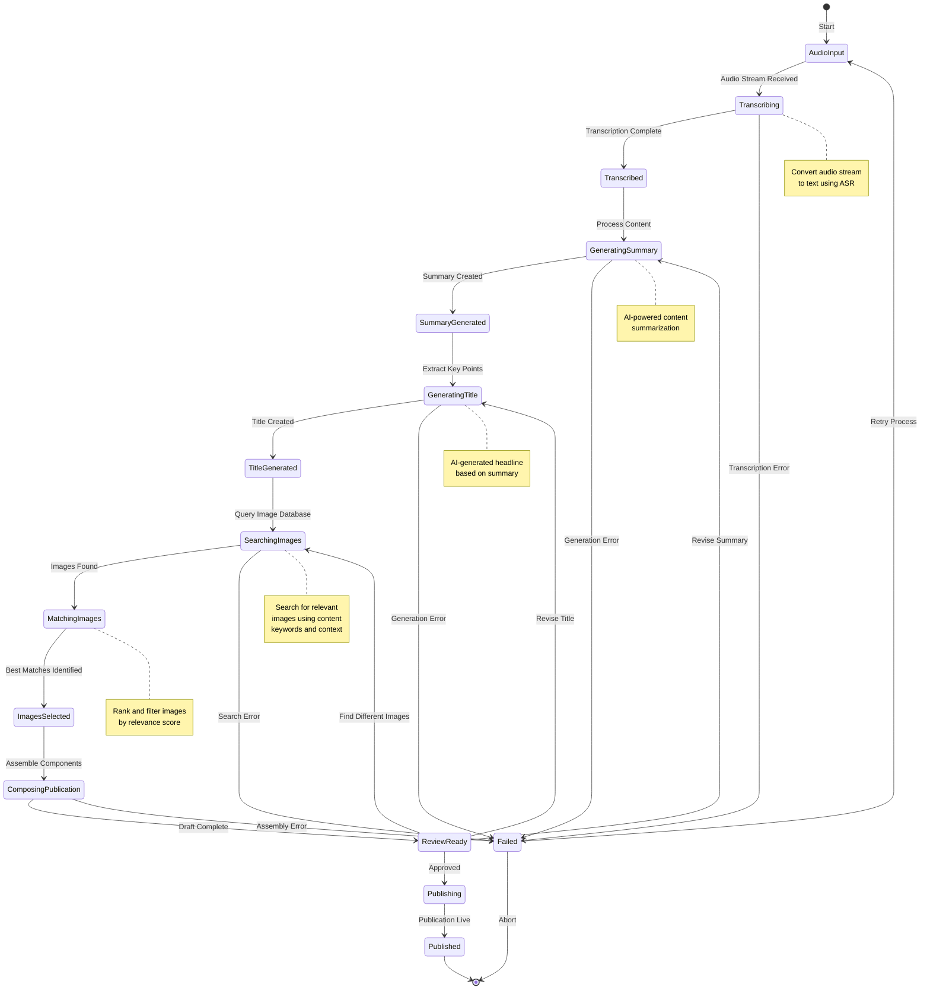

# Audio Stream to Publication - State Machine

```mermaid
stateDiagram-v2
    [*] --> AudioInput: Start

    AudioInput --> Transcribing: Audio Stream Received
    Transcribing --> Transcribed: Transcription Complete

    Transcribed --> GeneratingSummary: Process Content
    GeneratingSummary --> SummaryGenerated: Summary Created

    SummaryGenerated --> GeneratingTitle: Extract Key Points
    GeneratingTitle --> TitleGenerated: Title Created

    TitleGenerated --> SearchingImages: Query Image Database
    SearchingImages --> MatchingImages: Images Found
    MatchingImages --> ImagesSelected: Best Matches Identified

    ImagesSelected --> ComposingPublication: Assemble Components
    ComposingPublication --> ReviewReady: Draft Complete

    ReviewReady --> Publishing: Approved
    ReviewReady --> GeneratingSummary: Revise Summary
    ReviewReady --> GeneratingTitle: Revise Title
    ReviewReady --> SearchingImages: Find Different Images

    Publishing --> Published: Publication Live
    Published --> [*]

    Transcribing --> Failed: Transcription Error
    GeneratingSummary --> Failed: Generation Error
    GeneratingTitle --> Failed: Generation Error
    SearchingImages --> Failed: Search Error
    ComposingPublication --> Failed: Assembly Error

    Failed --> AudioInput: Retry Process
    Failed --> [*]: Abort

    note right of Transcribing
        Convert audio stream
        to text using ASR
    end note

    note right of GeneratingSummary
        AI-powered content
        summarization
    end note

    note right of GeneratingTitle
        AI-generated headline
        based on summary
    end note

    note right of SearchingImages
        Search for relevant
        images using content
        keywords and context
    end note

    note right of MatchingImages
        Rank and filter images
        by relevance score
    end note
```
